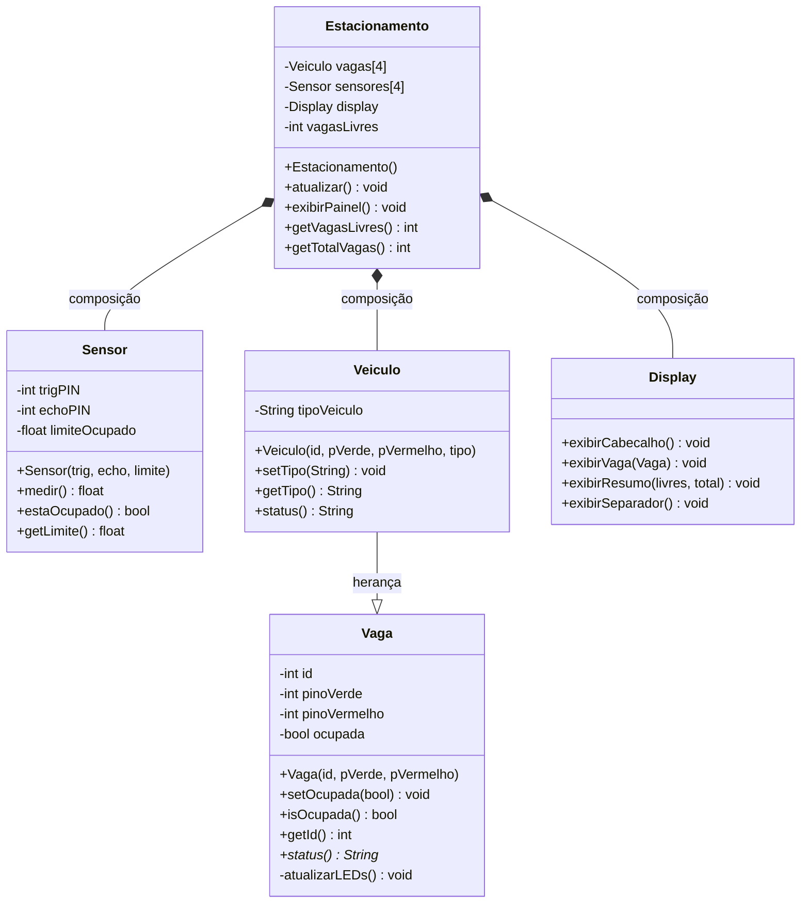

# Diagrama de Classes — Estacionamento Inteligente

```mermaid
classDiagram
    class Sensor {
        -int trigPIN
        -int echoPIN
        -float limiteOcupado
        +Sensor(trig, echo, limite)
        +medir() float
        +estaOcupado() bool
        +getLimite() float
    }

    class Vaga {
        -int id
        -int pinoVerde
        -int pinoVermelho
        -bool ocupada
        +Vaga(id, pVerde, pVermelho)
        +setOcupada(bool) void
        +isOcupada() bool
        +getId() int
        +status()* String
        -atualizarLEDs() void
    }

    class Veiculo {
        -String tipoVeiculo
        +Veiculo(id, pVerde, pVermelho, tipo)
        +setTipo(String) void
        +getTipo() String
        +status() String
    }

    class Display {
        +exibirCabecalho() void
        +exibirVaga(Vaga) void
        +exibirResumo(livres, total) void
        +exibirSeparador() void
    }

    class Estacionamento {
        -Veiculo vagas[4]
        -Sensor sensores[4]
        -Display display
        -int vagasLivres
        +Estacionamento()
        +atualizar() void
        +exibirPainel() void
        +getVagasLivres() int
        +getTotalVagas() int
    }

    Veiculo --|> Vaga : herança
    Estacionamento *-- Veiculo : composição
    Estacionamento *-- Sensor : composição
    Estacionamento *-- Display : composição
```
